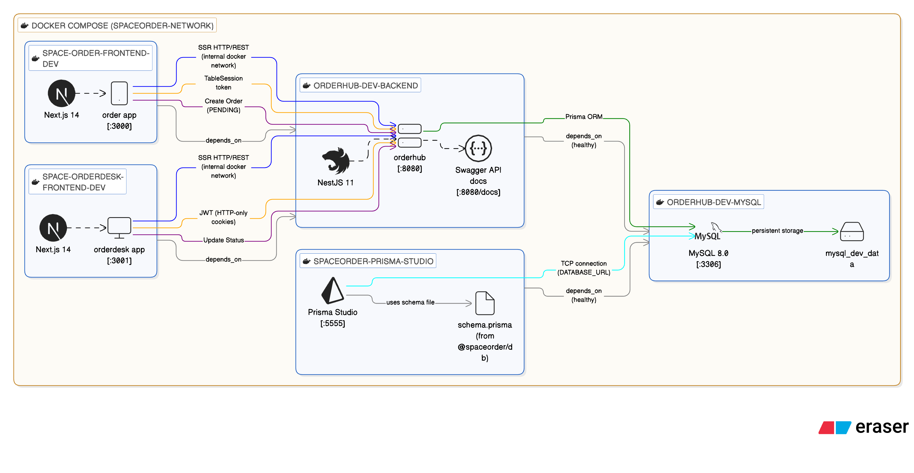
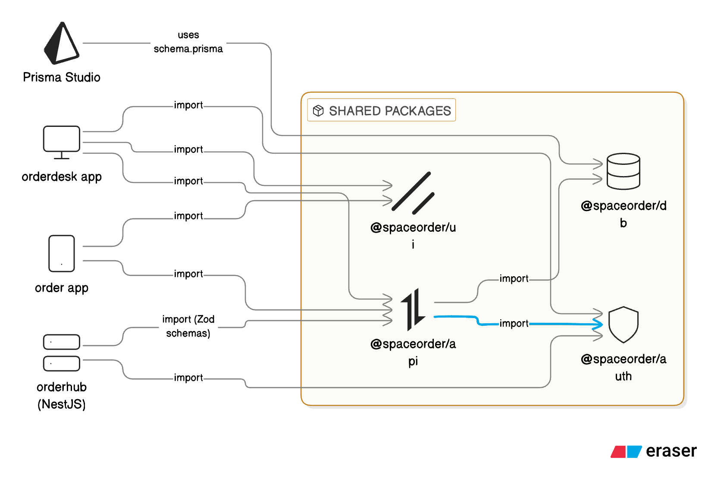
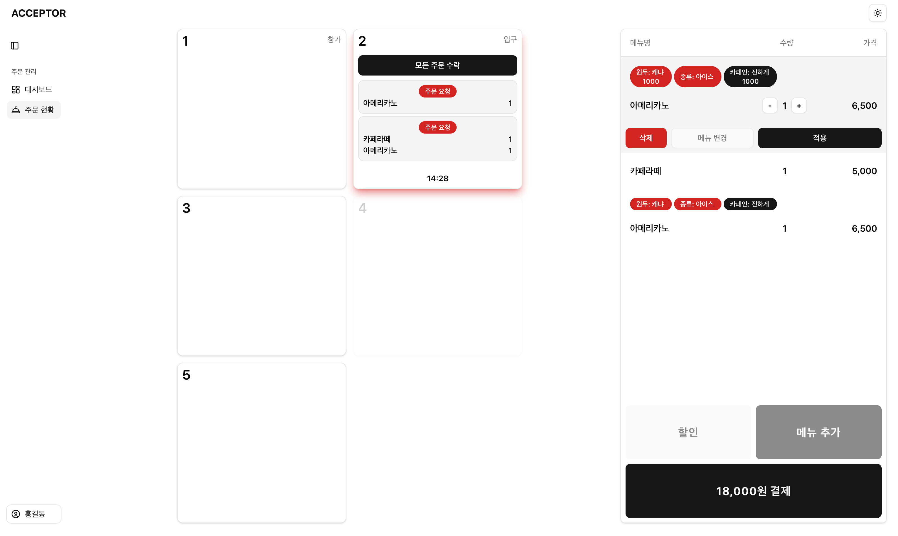
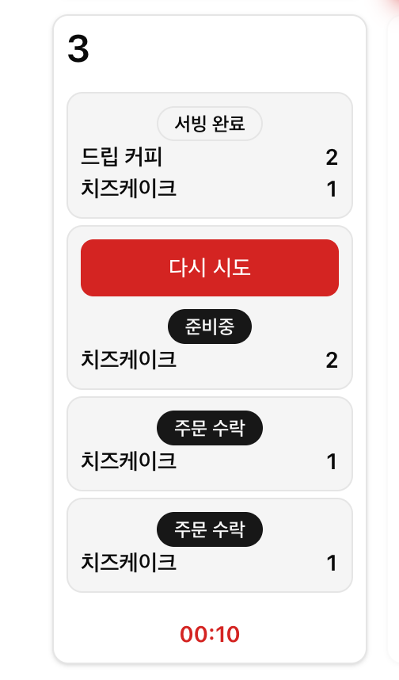
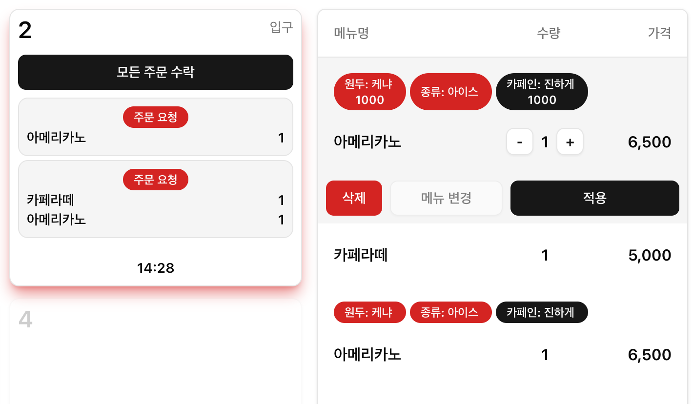

# Space Order

> **오프라인 주문의 형태를 재설계하다.**

카페나 음식점에서 주문할 때, 직접 대면으로 주문하거나 키오스크, 테이블에 비치된 전용 디바이스를 사용합니다.

**고객마다 모바일 디바이스를 가지고 있는데, 왜 별도의 하드웨어를 매장에 두어야 할까요?**

Space Order 프로젝트는 이 질문에서 시작되었습니다.

### BYOD (Bring Your Own Device)

고객의 스마트폰으로 QR 코드를 스캔하면 바로 주문이 가능합니다. 별도의 앱 설치 없이 브라우저에서 동작하며, 어떤 디바이스에서든 동일한 경험을 제공합니다.

| 고객 혜택                        | 사업주 혜택                            |
| -------------------------------- | -------------------------------------- |
| 점원과 마주하지 않고 편하게 주문 | 인건비 절감                            |
| 상세한 메뉴 정보로 더 나은 선택  | 하드웨어 구독 비용 불필요              |
| 대기 없이 빠른 주문              | 메뉴/품절 상태/테이블 정보 실시간 관리 |

### 확장 가능성

- 테이블별 시간 제한 설정
- 이벤트 및 할인 빠른 적용
- 주문과 동시에 선결제 유도
- 주문 데이터 기반 인사이트
- 재고 관리 서비스 (알림)
- OpenAPI 확장으로 AI Agent를 통한 주문 시스템

Space Order는 오프라인 주문을 소프트웨어와 접목시켜 **고객과 사업주를 End-to-End로 연결**하는 서비스입니다.

---

## Architecture




Space Order는 QR 코드 기반 테이블 주문 시스템으로, 고객용 주문 앱과 매장 관리자용 주문 접수 앱으로 구성됩니다. 모노레포 구조로 공통 패키지를 공유하여 일관된 타입과 비즈니스 로직을 유지합니다.

> [Architecture Decision Records (ADRs)](https://www.notion.so/ACCEPTOR-2a6b9430272080a380e2cd2c6ec17556)

## Key Features

- **QR 코드 기반 주문**: 고객이 테이블의 QR 코드를 스캔하여 직접 주문 (구현 중)
- **실시간 주문 현황**: 매장 관리자가 테이블별 주문 상태를 실시간으로 확인 (실시간 데이터 업데이트 미구현, 새로고침 필요)
- **주문 상태 관리**: PENDING → ACCEPTED → PREPARING → COMPLETED 흐름으로 주문 처리
- **테이블 세션 관리**: 테이블별 세션으로 주문 그룹화 및 결제 관리
- **메뉴 옵션 시스템**: 필수 옵션과 선택 옵션을 지원하는 유연한 메뉴 구성
- **JWT 인증**: Access/Refresh 토큰 기반의 안전한 인증 시스템

## Tech Stack

| Category             | Technology                            |
| -------------------- | ------------------------------------- |
| **Monorepo**         | Turborepo + pnpm workspaces           |
| **Frontend**         | Next.js 14, React 18, Tailwind CSS v4 |
| **Backend**          | NestJS 11, Passport.js, Swagger       |
| **Database**         | MySQL 8.0, Prisma ORM                 |
| **UI Components**    | Radix UI, Lucide Icons                |
| **State Management** | TanStack Query (React Query)          |
| **Form**             | React Hook Form, Zod                  |
| **DevOps**           | Docker, Docker Compose                |

## Project Structure

```
space-order/
├── apps/
│   ├── order/          # 고객용 주문 앱 (Next.js, port 3000)
│   ├── orderdesk/      # 관리자용 주문 접수 앱 (Next.js, port 3001)
│   └── orderhub/       # 백엔드 API 서버 (NestJS, port 8080)
├── packages/
│   ├── db/             # Prisma 스키마 및 클라이언트 (SSOT)
│   ├── api/            # React Query hooks, Axios HTTP 클라이언트
│   ├── auth/           # Zod 스키마, JWT 유틸리티
│   ├── ui/             # Radix UI 기반 공통 컴포넌트
│   ├── lintconfig/     # ESLint 9 FlatConfig
│   └── tsconfig/       # 공유 TypeScript 설정
├── docs/               # 프로젝트 문서 및 이미지
├── scripts/            # 셸 스크립트
└── docker-compose.yml  # 개발 환경 Docker 설정
```

## Getting Started

### Prerequisites

- Node.js >= 18
- pnpm >= 9.0.0
- Docker & Docker Compose

### Quick Start

#### 1. Clone the repository

```bash
git clone https://github.com/kisn3089/space-order
cd space-order
```

#### 2. Configure environment variables

```bash
cp .env.example .env
# .env 파일을 열어 필요한 값 설정
```

#### 3. Start the services

```bash
./scripts/start_all.sh
```

### Stop the services

```bash
./scripts/start_all.sh --stop
```

### Access Services

| Service           | URL                        | Description           |
| ----------------- | -------------------------- | --------------------- |
| **order**         | http://localhost:3000      | 고객용 주문 앱        |
| **orderdesk**     | http://localhost:3001      | 관리자용 주문 접수 앱 |
| **orderhub**      | http://localhost:8080      | 백엔드 API            |
| **Swagger Docs**  | http://localhost:8080/docs | API 문서              |
| **Prisma Studio** | http://localhost:5555      | 데이터베이스 GUI      |

## Web UI

<table>
  <tr>
    <td colspan="2"><b>주문 현황 페이지</b><br/></td>
  </tr>
  <tr>
    <td><b>주문 상태 업데이트 실패</b><br/></td>
    <td><b>선택한 테이블의 상세 주문 내역</b><br/></td>
  </tr>
</table>

<video src="https://github.com/user-attachments/assets/546e9bc0-23ef-4dfb-9fe8-a58333d1de09"></video>

**주문 현황 페이지:** 매장의 모든 테이블과 주문 상태를 한눈에 확인할 수 있는 대시보드입니다. 테이블별로 현재 주문 내역과 상태가 실시간으로 표시됩니다.

**주문 상태 업데이트 실패:** 네트워크 오류 등으로 주문 상태 변경이 실패할 경우 사용자에게 명확한 피드백을 제공합니다.

**선택한 테이블의 상세 주문 내역:** 특정 테이블을 선택하면 해당 테이블의 상세 주문 내역을 확인하고, 메뉴 수량 변경, 삭제, 추가 등의 작업을 수행할 수 있습니다.

## Development

### Local Development (without Docker)

```bash
# 의존성 설치
pnpm install

# Prisma 클라이언트 생성
pnpm prisma:generate

# 모든 앱 개발 서버 실행
pnpm dev

# 개별 앱 실행
pnpm dev:order       # 고객 앱 (3000)
pnpm dev:orderdesk   # 관리자 앱 (3001)
pnpm dev:orderhub    # 백엔드 API (8080)
```

### Database Commands

```bash
pnpm prisma:generate   # Prisma 클라이언트 생성
pnpm prisma:migrate    # 마이그레이션 실행
pnpm prisma:studio     # Prisma Studio 실행
pnpm prisma:seed       # 시드 데이터 삽입
pnpm prisma:reset      # 데이터베이스 리셋
```

### Build & Quality

```bash
pnpm build         # 전체 빌드
pnpm check-types   # 타입 체크
pnpm lint          # ESLint 검사
pnpm format        # Prettier 포맷팅
```

### Testing (orderhub)

```bash
pnpm --filter=orderhub test        # 단위 테스트
pnpm --filter=orderhub test:watch  # 워치 모드
pnpm --filter=orderhub test:cov    # 커버리지 리포트
pnpm --filter=orderhub test:e2e    # E2E 테스트
```

## Database Schema

### Models

| Model            | Description                                 |
| ---------------- | ------------------------------------------- |
| **Admin**        | 시스템 관리자 (SUPER, SUPPORT, VIEWER 역할) |
| **Owner**        | 매장 사장님                                 |
| **Store**        | 매장 정보                                   |
| **Table**        | 매장 테이블 (QR 코드 포함)                  |
| **Menu**         | 메뉴 (필수/선택 옵션 지원)                  |
| **Order**        | 주문                                        |
| **OrderItem**    | 주문 항목 (옵션 스냅샷 포함)                |
| **TableSession** | 테이블 세션 (주문 그룹화)                   |

### Order Status Flow

```
PENDING → ACCEPTED → PREPARING → COMPLETED
    ↓
CANCELLED
```

### Table Session Status Flow

```
WAITING_ORDER → ACTIVE → PAYMENT_PENDING → CLOSED
```

## Environment Variables

| Variable                   | Description           | Default               |
| -------------------------- | --------------------- | --------------------- |
| `SERVER_PORT`              | 백엔드 서버 포트      | 8080                  |
| `DB_PORT`                  | MySQL 포트            | 3306                  |
| `DB_NAME`                  | 데이터베이스 이름     | spaceorder            |
| `DB_USER`                  | 데이터베이스 사용자   | -                     |
| `DB_PASSWORD`              | 데이터베이스 비밀번호 | -                     |
| `DATABASE_URL`             | Prisma 연결 문자열    | -                     |
| `JWT_ACCESS_TOKEN_SECRET`  | Access 토큰 시크릿    | -                     |
| `JWT_REFRESH_TOKEN_SECRET` | Refresh 토큰 시크릿   | -                     |
| `ORDERHUB_URL`             | 백엔드 API URL        | http://localhost:8080 |

## Docker Commands

```bash
docker compose up -d              # 모든 서비스 시작
docker compose up -d mysql        # MySQL만 시작
docker compose down               # 모든 서비스 중지
docker compose logs -f orderhub   # 백엔드 로그 확인
```
