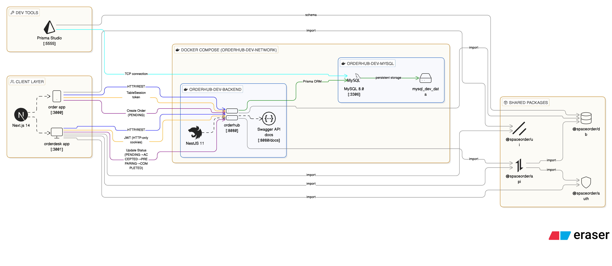
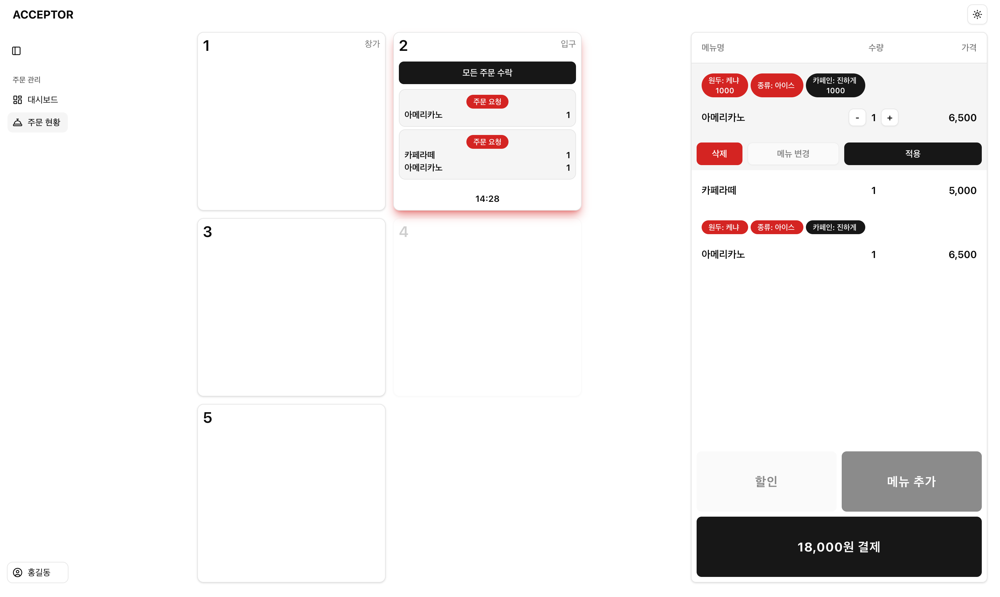
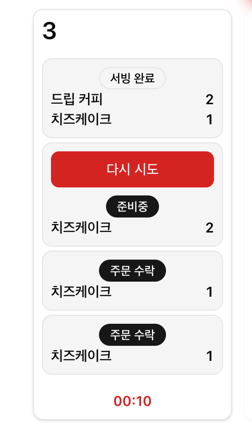
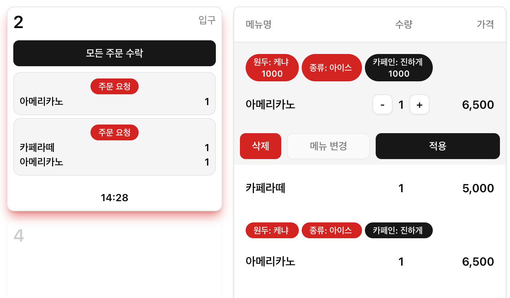

## 🏗️ Architecture



WeKnora employs a modern modular design to build a complete document understanding and retrieval pipeline. The system primarily includes document parsing, vector processing, retrieval engine, and large model inference as core modules, with each component being flexibly configurable and extendable.

## 🎯 Key Features

- **🤖 Agent Mode**: Support for ReACT Agent mode that can use built-in tools to retrieve knowledge bases, MCP tools, and web search tools to access external services, providing comprehensive summary reports through multiple iterations and reflection
- **🔍 Precise Understanding**: Structured content extraction from PDFs, Word documents, images and more into unified semantic views
- **🧠 Intelligent Reasoning**: Leverages LLMs to understand document context and user intent for accurate Q&A and multi-turn conversations
- **📚 Multi-Type Knowledge Bases**: Support for FAQ and document knowledge base types, with folder import, URL import, tag management, and online entry capabilities
- **🔧 Flexible Extension**: All components from parsing and embedding to retrieval and generation are decoupled for easy customization
- **⚡ Efficient Retrieval**: Hybrid retrieval strategies combining keywords, vectors, and knowledge graphs, with cross-knowledge base retrieval support
- **🌐 Web Search**: Support for extensible web search engines with built-in DuckDuckGo search engine
- **🔌 MCP Tool Integration**: Support for extending Agent capabilities through MCP, with built-in uvx and npx launchers, supporting multiple transport methods
- **⚙️ Conversation Strategy**: Support for configuring Agent models, normal mode models, retrieval thresholds, and Prompts, with precise control over multi-turn conversation behavior
- **🎯 User-Friendly**: Intuitive web interface and standardized APIs for zero technical barriers
- **🔒 Secure & Controlled**: Support for local deployment and private cloud, ensuring complete data sovereignty

## 📊 Application Scenarios

| Scenario                            | Applications                                                               | Core Value                                                    |
| ----------------------------------- | -------------------------------------------------------------------------- | ------------------------------------------------------------- |
| **Enterprise Knowledge Management** | Internal document retrieval, policy Q&A, operation manual search           | Improve knowledge discovery efficiency, reduce training costs |
| **Academic Research Analysis**      | Paper retrieval, research report analysis, scholarly material organization | Accelerate literature review, assist research decisions       |
| **Product Technical Support**       | Product manual Q&A, technical documentation search, troubleshooting        | Enhance customer service quality, reduce support burden       |
| **Legal & Compliance Review**       | Contract clause retrieval, regulatory policy search, case analysis         | Improve compliance efficiency, reduce legal risks             |
| **Medical Knowledge Assistance**    | Medical literature retrieval, treatment guideline search, case analysis    | Support clinical decisions, improve diagnosis quality         |

#### ① Clone the repository

```bash
# Clone the main repository
git clone https://github.com/Tencent/WeKnora.git
cd space-order
```

#### ② Configure environment variables

```bash
# Copy example env file
cp .env.example .env

# Edit .env and set required values
```

#### ③ Start the services (include Ollama)

Check the images that need to be started in the .env file.

```bash
./scripts/start_all.sh
```

### 🌐 Access Services

Once started, services will be available at:

- orderdesk [Web UI]: `http://localhost:3001`
- orderhub [Backend API]: `http://localhost:8080`
- Swagger API docs: `http://localhost:8080/docs`
- Prisma Studio: `http://localhost:5555`

### Web UI Interface

<table>
  <tr>
    <td colspan="2"><b>주문 현황 페이지</b><br/></td>
  </tr>
  <tr>
    <td><b>주문 상태 업데이트 실패</b><br/></td>
    <td><b>선택한 테이블의 상세한 주문 내역을 확인</b><br/></td>
  </tr>
</table>

**주문 현황 페이지:** Support for creating FAQ and document knowledge base types, with multiple import methods including drag-and-drop, folder import, and URL import. Automatically identifies document structures and extracts core knowledge to establish indexes. Supports tag management and online entry. The system clearly displays processing progress and document status, achieving efficient knowledge base management.

**주문 상태 업데이트 실패:** Support for ReACT Agent mode that can use built-in tools to retrieve knowledge bases, call user-configured MCP tools and web search tools to access external services, providing comprehensive summary reports through multiple iterations and reflection. Supports cross-knowledge base retrieval, allowing selection of multiple knowledge bases for simultaneous retrieval.

**선택한 테이블의 상세한 주문 내역을 확인:** Support for configuring Agent models, normal mode models, retrieval thresholds, and online Prompt configuration, with precise control over multi-turn conversation behavior and retrieval execution methods. The conversation input box supports Agent mode/normal mode switching, enabling/disabling web search, and selecting conversation models.

**Development Advantages:**

- ✅ Frontend modifications auto hot-reload (no restart needed)
- ✅ Backend modifications quick restart (5-10 seconds, supports Air hot-reload)
- ✅ No need to rebuild Docker images
- ✅ Support IDE breakpoint debugging

### 📁 Directory Structure

```
WeKnora/
├── client/      # go client
├── cmd/         # Main entry point
├── config/      # Configuration files
├── docker/      # docker images files
├── docreader/   # Document parsing app
├── docs/        # Project documentation
├── frontend/    # Frontend app
├── internal/    # Core business logic
├── mcp-server/  # MCP server
├── migrations/  # DB migration scripts
└── scripts/     # Shell scripts
```
